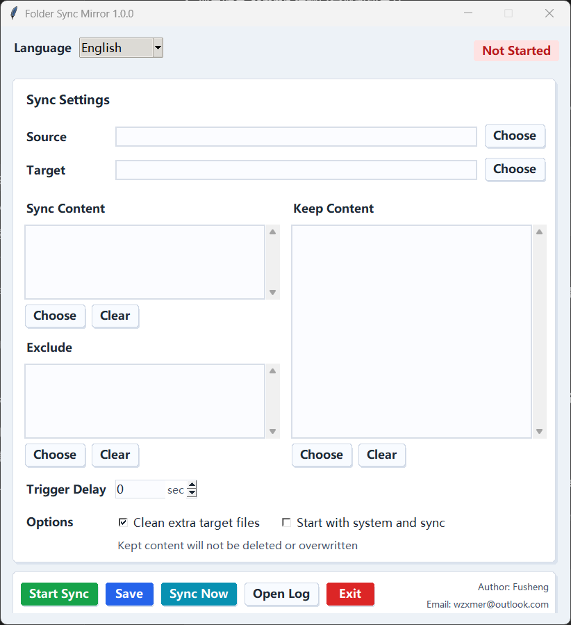

# 天行键同步助手

天行键同步助手 is a desktop tray app for txjx folder synchronization and zzc merge. It watches a source folder, copies selected content into a target folder, and can remove extra target files so the target stays consistent with the selected source content.

Version: `1.0.0`

[中文介绍](docs/README.zh-CN.md)



## Features

- One-way source-to-target synchronization.
- Source and target folder selection in the app.
- Language switch between Chinese and English.
- Include rules for syncing only selected files or folders.
- Source exclusion rules for content that should not be copied.
- Target protected content that will not be deleted or overwritten.
- Target cleanup scope for limiting where extra target files may be deleted.
- Event-based source and managed-target folder watching with configurable trigger delay.
- Optional cleanup of extra target files.
- Tray background mode with pause, resume, manual sync, log opening, and close-to-tray behavior.
- Optional startup mode that launches in the background and starts synchronization automatically.
- Log cleanup by size.

## Usage

Download the installer for your platform from the release page.

Windows users can install with:

```text
txjxSyncAssistant_1.0.0_x64-setup.exe
```

Windows also provides `txjxSyncAssistant.exe` as a portable option.

macOS users can install with:

```text
txjxSyncAssistant_1.0.0_x64.dmg
```

Linux users can install the DEB or RPM package:

```text
txjxSyncAssistant_1.0.0_amd64.deb
txjxSyncAssistant_1.0.0_x86_64.rpm
```

Synchronization is disabled by default. Select a source folder and target folder, adjust the rules if needed, then click `Start Sync`. After synchronization starts, the same button becomes `Pause Sync`.

Closing the window hides the app to the tray instead of exiting. Use the in-app `Exit` button or the tray menu to quit.

## Rules

The source folder is the authority. The target folder is managed to match the selected source content.

- `Include` controls what should be synced. Empty means everything.
- `Exclude` removes matching source content from syncing.
- `Keep` protects matching target content from deletion and overwrite.
- `Deleted Files` controls where extra target files may be deleted. Empty means the whole target.
- `Clean extra target files` removes unmanaged target files inside `Deleted Files` unless they match `Keep`.

Folder rules usually use the `folder/**` pattern.

## Multi-Task Mode

The app can run multiple enabled tasks from `tasks[]`.

- Every task watches its own source and syncs to its target.
- On each change, files are copied or overwritten unless protected, and extra target files are deleted when `Clean extra target files` allows it.
- A task can also merge zzc records when its merge settings are enabled.
- Different target resources run in parallel.
- Same or parent/child target resources are serialized.
- Empty `tasks: []` keeps the legacy single-task form.

The desktop UI can add, duplicate, delete, enable, and edit tasks. New tasks are disabled by default until their paths are filled.

When auto zzc merge is enabled, sync protects `*.zzc.dict.yaml` and `zzc_state/zzc_reset.tsv`; the merge step owns updates to them.

## Author

Author: 浮生  
Email: wzxmer@outlook.com
