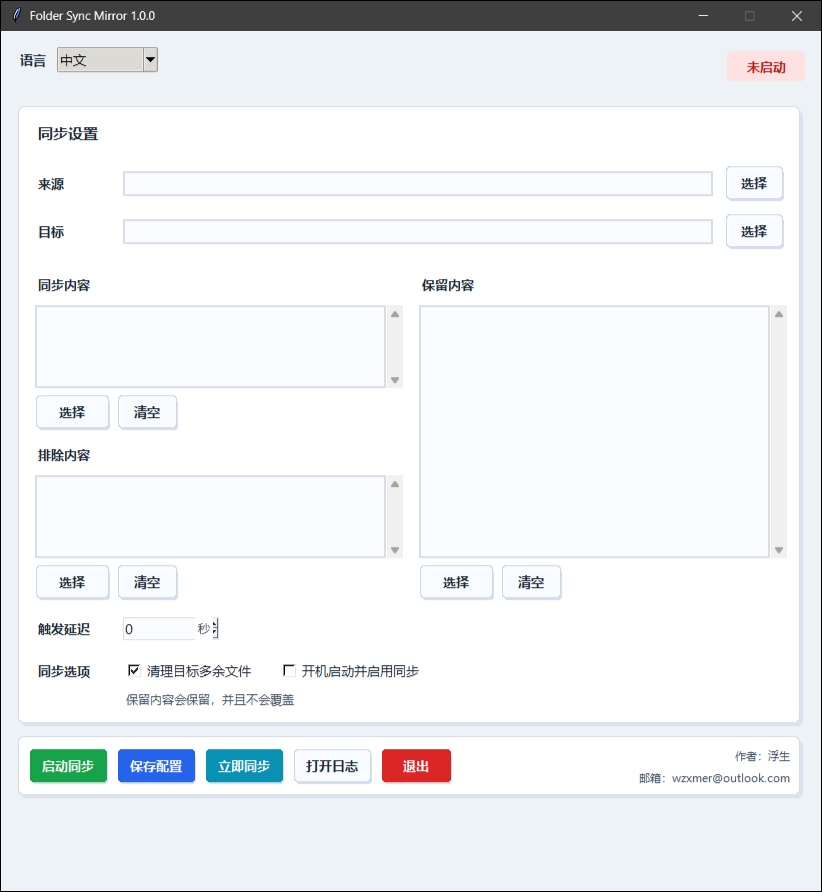

# Folder Sync Mirror 中文介绍

Folder Sync Mirror 是一个用于单向镜像同步文件夹的桌面托盘软件。它会监听“来源”文件夹的变化，把选中的内容同步到“目标”文件夹，并可以删除目标中多出的文件，让目标与来源中被选择同步的内容保持一致。

当前版本：`1.0.0`

[English README](../README.md)



## 主要功能

- 来源到目标的单向同步。
- 在软件中选择来源文件夹和目标文件夹。
- 软件内可切换中文和英文界面。
- 可设置只同步哪些文件或文件夹。
- 可排除来源中不需要同步的内容。
- 可设置目标中的保留内容，保留内容不会被删除，也不会被覆盖。
- 监听来源变化后自动同步，可设置触发延迟，最低 0 秒。
- 可清理目标中多出的文件。
- 支持托盘后台运行、暂停、继续、立即同步、打开日志。
- 点击关闭窗口会收起到托盘，不会退出程序。
- 可开启开机启动并自动开始同步。
- 日志按大小自动清理。

## 使用方法

从 Release 页面下载对应平台的安装包。

Windows 可安装：

```text
FolderSyncMirror_1.0.0_x64-setup.exe
```

Windows 也会提供 `FolderSyncMirror.exe` 作为免安装版本。

macOS 可安装：

```text
FolderSyncMirror_1.0.0_x64.dmg
```

Linux 可安装 DEB 或 RPM：

```text
FolderSyncMirror_1.0.0_amd64.deb
FolderSyncMirror_1.0.0_x86_64.rpm
```

默认不会自动启动同步。先选择来源文件夹和目标文件夹，再按需要设置同步内容、排除内容和保留内容，最后点击“启动同步”。启动后按钮会变成“暂停同步”。

关闭窗口只会收起到托盘。需要退出时，请点击窗口里的“退出”或托盘菜单里的“退出”。

## 规则说明

来源是标准内容，目标是被同步和清理的目录。

- `同步内容`：只同步哪些来源内容。留空表示同步全部。
- `排除内容`：来源中不参与同步的内容，优先级高于同步内容。
- `保留内容`：目标中不想被删除或覆盖的内容。
- `清理目标多余文件`：开启后，目标中不属于同步结果且不在保留内容里的文件会被删除。

文件夹规则通常使用：

```text
folder/**
```

## 作者

作者：浮生  
联系邮箱：wzxmer@outlook.com
